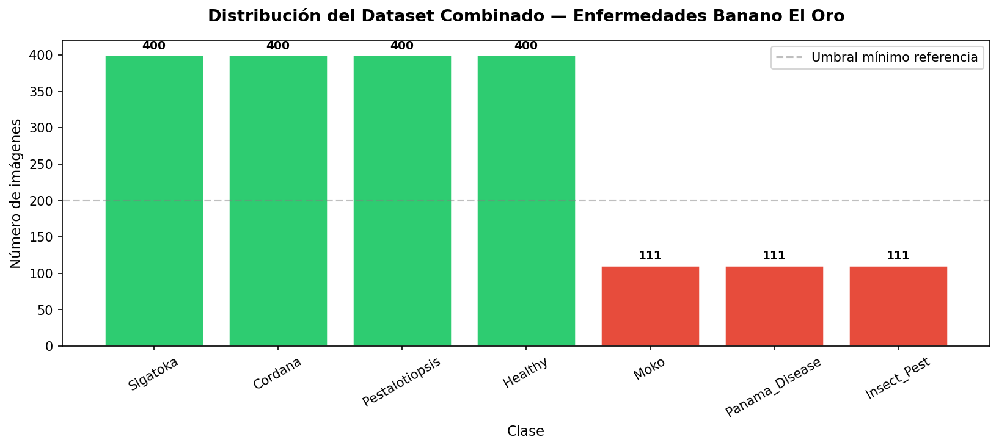
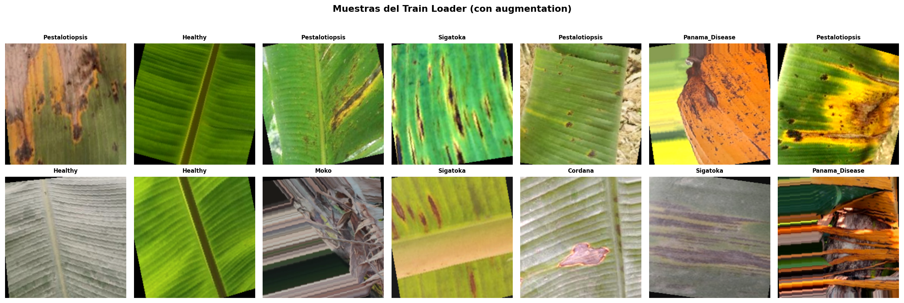
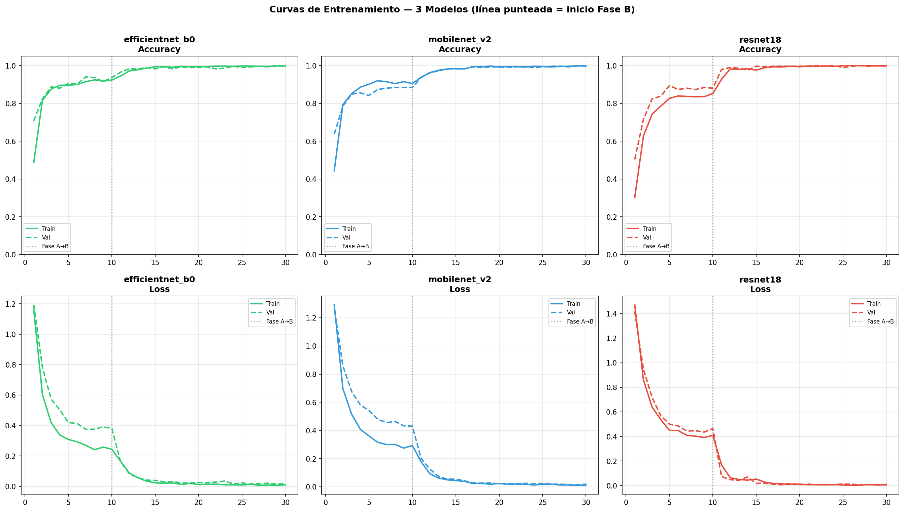
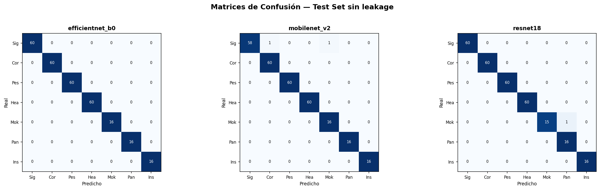
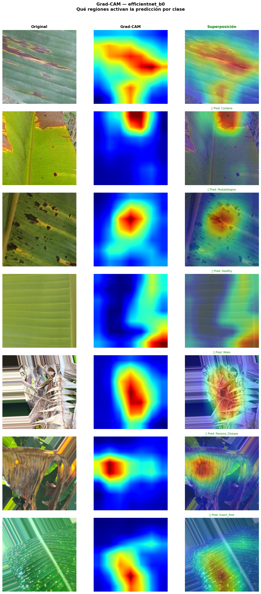
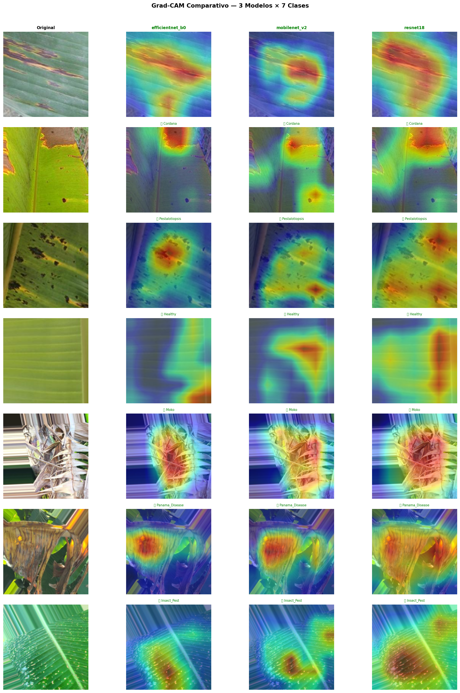

# 🍌 Clasificador de Enfermedades en Hojas de Banano — El Oro, Ecuador

Sistema de deep learning end-to-end para detectar 7 enfermedades en hojas de banano, orientado a productores de la provincia de El Oro, Ecuador. Incluye el pipeline completo de entrenamiento (PyTorch), el modelo exportado a TFLite, y una app móvil Android funcional offline.

Desarrollado como proyecto de aplicación a la **Escuela de Primavera en Deep Learning — UBA/CONICET 2026**.

**Autor:** Joel Velásquez — Universidad Técnica de Machala (UTMACH)

---

## 🔗 Enlaces

- **Modelo entrenado:** [HuggingFace — JoelVela/banano-eloro-classifier](https://huggingface.co/JoelVela/banano-eloro-classifier)
- **App móvil (APK):** ver carpeta `banano_eloro_app/`

---

## Tabla de contenidos

1. [Motivación](#motivación)
2. [Relación con trabajo previo](#relación-con-trabajo-previo)
3. [Clases y datasets](#clases-detectadas)
4. [Metodología completa](#metodología)
5. [El hallazgo del data leakage](#el-hallazgo-data-leakage)
6. [Resultados: entrenamiento de los 3 modelos](#resultados-de-entrenamiento)
7. [Evaluación en test set](#evaluación-en-test-set)
8. [Grad-CAM: interpretabilidad](#grad-cam)
9. [Validación con imágenes externas](#validación-externa)
10. [Exportación a TFLite y problemas resueltos](#exportación-tflite)
11. [App móvil](#app-móvil)
12. [Cómo correr el proyecto](#cómo-correr-el-proyecto)
13. [Limitaciones y trabajo futuro](#limitaciones-y-trabajo-futuro)
14. [Citación y licencia](#citación)

---

## Motivación

El Oro concentra **32,161 hectáreas** de banano (18% de la producción nacional de Ecuador). En diciembre 2025 se confirmó **Fusarium Raza Tropical 4** en la provincia, con 8,309 hectáreas en riesgo directo. Los pequeños productores rurales no tienen herramientas accesibles de diagnóstico temprano, especialmente en zonas sin conectividad estable.

Este proyecto entrena un clasificador de 7 enfermedades en hojas de banano y lo empaqueta en una **app Android que funciona completamente offline**, pensada para usarse en campo con un smartphone.

## Relación con trabajo previo

Jiménez et al. (2025), *"Detection of Leaf Diseases in Banana Crops Using Deep Learning Techniques"* (UTMACH), clasificaron 3 enfermedades (Black Sigatoka, Cordana, Healthy) con EfficientNetB0/ResNet50/VGG19 sobre un dataset propio de 900 imágenes recolectadas en fincas de El Oro, alcanzando 88.90% de accuracy.

Este proyecto extiende ese trabajo en cuatro dimensiones:

| Dimensión | Jiménez et al. 2025 | Este proyecto |
|-----------|---------------------|----------------|
| Clases | 3 | **7** (+ Moko, Panama Disease, Insect Pest) |
| Arquitecturas | ResNet50, VGG19, EfficientNetB0 | ResNet18, **MobileNetV2**, EfficientNetB0 |
| Framework | TensorFlow/Keras | **PyTorch** + fine-tuning en 2 fases |
| Despliegue | Webapp Angular/Firebase | **APK nativa offline** (TFLite + Flutter) |

---

## Clases detectadas

| # | Clase | Dataset fuente | Relevancia en El Oro |
|---|-------|-----------------|------------------------|
| 0 | Sigatoka | BananaLSD | Alta — endémica |
| 1 | Cordana | BananaLSD | Media |
| 2 | Pestalotiopsis | BananaLSD | Media |
| 3 | Healthy | BananaLSD | — |
| 4 | Moko | Banana Disease Recognition | Alta — cuarentena activa |
| 5 | Panama Disease | Banana Disease Recognition | Alta — relacionada a Fusarium R1 |
| 6 | Insect Pest | Banana Disease Recognition | Media |

**Clases excluidas por ausencia de datos validados:** Bacterial Wilt y Fusarium RT4 — documentadas como trabajo futuro.

## Datasets utilizados

| Dataset | Imágenes | Clases aportadas | Fuente |
|---------|----------|-------------------|--------|
| BananaLSD (Augmented) | 1,600 | Sigatoka, Cordana, Pestalotiopsis, Healthy | Kaggle: `shifatearman/bananalsd` — DOI: 10.1016/j.dib.2023.109608 |
| Banana Disease Recognition | 333 | Moko, Panama Disease, Insect Pest | HuggingFace: `as-cle-bert/banana-disease-classification` — DOI: 10.17632/79w2n6b4kf.1 |



---

## Metodología

### Arquitecturas comparadas

| Modelo | Parámetros | Tamaño | Rol |
|--------|-----------|--------|-----|
| EfficientNet-B0 | 4.0M | ~16.4 MB | Candidato principal por accuracy |
| MobileNetV2 | 2.2M | ~9.2 MB | Candidato para despliegue móvil |
| ResNet18 | 11.2M | ~44.8 MB | Línea base |

### Fine-tuning en dos fases

Los tres modelos se entrenaron con la misma estrategia, para que la comparación fuera justa:

- **Fase A — Feature Extraction** (10 épocas, lr=1e-3): backbone congelado (pesos de ImageNet sin tocar), solo se entrena el clasificador final. Evita que los gradientes grandes de un clasificador recién inicializado destruyan los pesos preentrenados.
- **Fase B — Fine-tuning completo** (20 épocas, lr=1e-4): se descongela toda la red y se ajusta con un learning rate 10x más bajo.

### Manejo del desbalance de clases

Las 4 clases de BananaLSD tienen 400 imágenes cada una (tras augmentation propia del dataset original); las 3 clases de HuggingFace tienen ~111 cada una — un desbalance de aproximadamente 3.6x. Se compensó con:

- **WeightedRandomSampler**: durante el entrenamiento, las imágenes de clases minoritarias tienen más probabilidad de ser muestreadas en cada batch.
- **Weighted CrossEntropyLoss**: los errores en clases minoritarias penalizan más que los errores en clases mayoritarias.

### Muestras del dataset de entrenamiento (con augmentation)



---

## El hallazgo: data leakage

Durante la verificación del dataset combinado se descubrió un problema metodológico importante, que se documenta acá con transparencia porque es parte central del rigor del proyecto.

**El problema:** `BananaLSD/AugmentedSet` contiene variantes generadas a partir de las mismas imágenes de `OriginalSet` (por ejemplo, `100.jpeg` → `100_aug.jpeg`), confirmado por inspección de nombres de archivo y comparación visual directa. Un split aleatorio simple sobre imágenes individuales podía colocar una imagen original y su variante aumentada en splits distintos (train y test), inflando artificialmente el accuracy de test — el modelo estaría siendo "evaluado" con una imagen casi idéntica a una que ya vio en entrenamiento.

Un segundo hallazgo relacionado: las tres clases provenientes de HuggingFace (Moko, Panama Disease, Insect Pest) **comparten el mismo esquema de nombres de archivo entre sí** (ej. `train_0056.jpg` existe simultáneamente en las tres clases), lo cual también podía confundir un agrupamiento ingenuo.

**La solución aplicada:** un split estratificado **por grupo**, no por imagen individual — todas las variantes de una misma imagen base (identificadas correctamente por clase) permanecen siempre juntas en el mismo split (train, val, o test).

```
Verificación de leakage tras la corrección:
   Grupos compartidos train∩val  : 0
   Grupos compartidos train∩test : 0
   Grupos compartidos val∩test   : 0
   ✅ Sin leakage — ningún grupo aparece en más de un split
```

Tras la corrección, los resultados en test set se mantuvieron altos (>99% en los tres modelos) — esto confirma que las clases son genuinamente separables por las arquitecturas utilizadas, y que el alto accuracy **no dependía** del leakage para lograrse. El script `debug_tflite.py` y el notebook documentan el proceso completo de detección y corrección.

---

## Resultados de entrenamiento

Los tres modelos se entrenaron con split corregido (sin leakage), 30 épocas totales cada uno (10 Fase A + 20 Fase B).



Observación relevante: con el split corregido, las curvas de validación muestran **fluctuaciones reales** entre épocas (en vez de converger instantáneamente a un valor perfecto y plano) — señal consistente con un aprendizaje genuino y no con memorización.

---

## Evaluación en test set

| Modelo | Accuracy | F1-macro | Precision | Recall | Tamaño |
|--------|----------|----------|-----------|--------|--------|
| EfficientNet-B0 | 100.00% | 100.00% | 100.00% | 100.00% | ~16.4 MB |
| ResNet18 | 99.65% | 99.11% | 99.16% | 99.11% | ~44.8 MB |
| **MobileNetV2** | 99.31% | 99.21% | 98.93% | 99.52% | ~9.2 MB |



*(Para comparación metodológica, también se conserva la [matriz de confusión de la corrida con el split original con leakage](banano_eloro_DL/figuras/matrices_confusion.png) — los números eran prácticamente idénticos, lo cual ayudó a confirmar que el dataset es separable por naturaleza, no por el leakage.)*

---

## Grad-CAM: interpretabilidad

Se utilizó Grad-CAM (Gradient-weighted Class Activation Mapping) para verificar que los modelos atienden a las lesiones reales de la hoja y no a artefactos de fondo, iluminación, o ruido.





Los mapas de calor confirman que los tres modelos focalizan correctamente en las lesiones patológicas específicas de cada enfermedad (rayas oscuras en Sigatoka, manchas redondeadas en Cordana/Pestalotiopsis, pudrición de pseudotallo en Moko, necrosis extensa en Panama Disease), validando que el aprendizaje es interpretable y no espurio.

---

## Validación externa

Se probaron 9 imágenes externas (fuera de ambos datasets de entrenamiento, obtenidas de bancos de imágenes profesionales como Shutterstock/Adobe Stock y sitios agrícolas especializados) sobre EfficientNet-B0 y MobileNetV2.

| Imagen | EfficientNet-B0 | MobileNetV2 |
|--------|-------------------|---------------|
| Panama Disease (1) | ✅ Panama_Disease (100.0%) | ✅ Panama_Disease (98.1%) |
| Panama Disease (2) | ✅ Panama_Disease (99.9%) | ✅ Panama_Disease (51.7%) |
| Sigatoka avanzada (1) | ❌ Moko (78.6%) | ❌ Insect_Pest (49.1%) |
| Sigatoka avanzada (2) | ❌ Panama_Disease (67.0%) | ❌ Moko (73.5%) |
| Sigatoka avanzada (3) | ❌ Moko (99.8%) | ❌ Moko (98.9%) |
| Sigatoka amarilla (1) | ❌ Panama_Disease (100.0%) | ❌ Panama_Disease (100.0%) |
| Sigatoka amarilla (2, temprana) | ✅ Sigatoka (98.6%) | ✅ Sigatoka (87.0%) |
| Sigatoka Ecuador | ❌ Panama_Disease (97.0%) | ❌ Panama_Disease (86.0%) |
| Hoja sana | ✅ Healthy (49.6%) | ✅ Healthy (93.9%) |

**Resultado: 4/9 aciertos (44%) en ambos modelos, en exactamente los mismos casos.**

**Patrón identificado:** el modelo clasifica correctamente Sigatoka en **etapa temprana** (lesiones individuales con halo definido), pero confunde sistemáticamente Sigatoka en **estadio avanzado** (necrosis extensa, hoja mayormente amarilla/seca) con Panama Disease o Moko.

Que el error se replique de forma casi idéntica entre dos arquitecturas distintas sugiere que la causa raíz es un sesgo del **dataset** (BananaLSD, recolectado en Bangladesh, predominantemente en estadios tempranos/intermedios de la enfermedad) y no una limitación específica de arquitectura — un caso típico de *dataset shift*.

Esto, paradójicamente, refuerza la elección de MobileNetV2 para la app: su ventaja de tamaño y velocidad no implica ninguna pérdida real de calidad frente a EfficientNet-B0, dado que ambos comparten exactamente la misma limitación.

---

## Exportación a TFLite

El modelo final (MobileNetV2) se exportó de PyTorch a TFLite mediante `litert-torch` (sucesor de `ai-edge-torch`), generando un archivo de ~9 MB con los **pesos entrenados reales** — verificado comparando las predicciones del modelo TFLite contra el modelo PyTorch original sobre las mismas imágenes, con resultados idénticos.

### Un bug real encontrado y corregido durante la integración con Flutter

Durante la integración en la app móvil apareció un error: `Bad state: failed precondition`, con el log nativo de TFLite mostrando:

```
tflite/kernels/conv.cc:353 input_channel % filter_input_channel != 0 (2 != 0)
Node number 2 (CONV_2D) failed to prepare.
```

**Causa raíz**, confirmada de forma independiente con un script de verificación en Python (`debug_tflite.py`, fuera de Flutter): el modelo exportado desde PyTorch espera el tensor de entrada en formato **NCHW** (`[1, 3, 224, 224]`, canales primero — el formato nativo de PyTorch), pero el código Dart inicial armaba el tensor en formato **NHWC** (`[1, 224, 224, 3]`, canales al final — el formato típico de TensorFlow/Flutter). Esto producía una incompatibilidad de canales que rompía la preparación del primer nodo convolucional.

Un segundo bug relacionado: el modelo retorna **logits crudos**, no probabilidades — faltaba aplicar softmax antes de mostrar el porcentaje de confianza (lo cual generaba valores sin sentido, como confianzas mostradas por encima de 100%).

Ambos se corrigieron en `lib/main.dart`: reconstrucción del tensor de entrada en layout NCHW y aplicación de softmax sobre los logits de salida. Verificado con imágenes reales del dataset, prediciendo correctamente tras la corrección.

---

## App móvil

Construida en Flutter, usando el plugin `tflite_flutter` para correr el modelo localmente en el dispositivo.

### Características

- Clasificación por **cámara** o **galería** del celular
- **Galería de 7 muestras internas** (una imagen real por clase) para hacer demos sin necesitar fotos propias ni conexión USB
- Gráfico de las **7 probabilidades completas**, no solo la clase ganadora — replicando el análisis del notebook
- Descripción breve de cada enfermedad (borrador inicial, basado en la documentación del modelo)
- Manejo de errores visible en pantalla
- **100% offline** — el modelo corre localmente, verificado en modo avión
- Ícono y nombre propios ("Banano El Oro")
- APK optimizado: ~44 MB (build específico para arquitectura `arm64-v8a`, vs. ~74 MB del build universal)

### Correr la app localmente

```bash
cd banano_eloro_app
flutter pub get
flutter run
```

### Generar el APK

```bash
flutter build apk --release --target-platform android-arm64
```

El archivo queda en `build/app/outputs/flutter-apk/app-release.apk`.

---

## Estructura del repositorio

```
banano-eloro-classifier/
├── banano_eloro_DL/                       Notebook de entrenamiento y experimentación
│   ├── banano_eloro_classifier.ipynb
│   ├── debug_tflite.py                    Verificación independiente del modelo TFLite (Python)
│   ├── figuras/                           Curvas, matrices de confusión, Grad-CAM, distribución
│   └── validacion_externa/                Resultados de validación con imágenes externas
│
└── banano_eloro_app/                      App Flutter (Android)
    ├── lib/                               Código fuente Dart
    ├── assets/
    │   ├── mobilenet_v2_banano.tflite     Modelo exportado (pesos reales, verificado)
    │   └── galeria/                       7 imágenes de muestra para demo sin cámara
    └── pubspec.yaml
```

*Los checkpoints `.pth` (EfficientNet-B0, ResNet18, MobileNetV2) no están en este repositorio por tamaño — están disponibles en [HuggingFace](https://huggingface.co/JoelVela/banano-eloro-classifier).*

---

## Cómo correr el proyecto

### Notebook de entrenamiento

Pensado para correr en Google Colab con GPU:

1. Abrir `banano_eloro_DL/banano_eloro_classifier.ipynb` en Colab
2. Configurar credenciales de Kaggle (`kaggle.json`) cuando se solicite
3. Ejecutar las celdas en orden — descarga datasets, combina, entrena los 3 modelos, evalúa, exporta a TFLite

### App móvil

Ver sección [App móvil](#app-móvil) arriba.

---

## Limitaciones y trabajo futuro

- **Sigatoka en estadio avanzado**: el modelo confunde necrosis extensa con Panama Disease/Moko — ver sección de [validación externa](#validación-externa). Causa probable: dataset shift geográfico.
- **Bacterial Wilt y Fusarium RT4**: sin datasets públicos suficientes al momento del entrenamiento.
- **Conversión de pesos entrenados a TFLite en entornos restringidos**: PyTorch 2.11 presentó conflictos con `onnxscript` para exportación vía ONNX; se resolvió usando `litert-torch` como ruta alternativa.
- **Backend en la nube**: se propone como trabajo futuro implementar recolección de imágenes de campo (con consentimiento del usuario) para reentrenamiento periódico con datos reales de El Oro.
- **Datos propios**: incorporar fotos recolectadas directamente en fincas de El Oro, siguiendo la metodología de campo de Jiménez et al. (2025).
- **Validación con patólogo vegetal**: confirmar formalmente los hallazgos sobre confusión en estadios avanzados de Sigatoka.

---

## Citación

Si usás este proyecto, por favor citá los datasets originales:

```bibtex
@article{arman2023bananalsd,
  title={BananaLSD: A banana leaf images dataset for classification of banana leaf diseases using machine learning},
  author={Arman, Shifat E and Bhuiyan, Md Abdullahil Baki and Abdullah, Hasan Muhammad and Islam, Shariful and Chowdhury, Tahsin Tanha and Hossain, Md Arban},
  journal={Data in Brief},
  year={2023},
  publisher={Elsevier}
}

@article{mafi2023bananadisease,
  title={Banana Disease Recognition Dataset},
  author={Mafi, Md Mafiul Hasan Matin and Sifat, R.M. and Moazzam, Md. Golam Moazzam and Uddin, Mohammad Shorif},
  journal={Mendeley Data},
  volume={V1},
  year={2023},
  doi={10.17632/79w2n6b4kf.1}
}
```

## Licencia

Este proyecto está bajo licencia MIT — ver el archivo `LICENSE` para más detalles.
